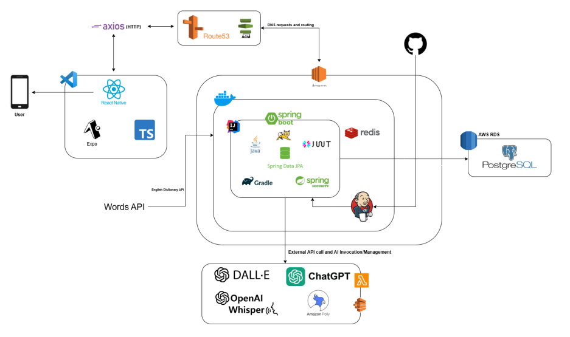

# StoryCraft - AI 영어 동화 학습 앱

> 2025 한이음 드림업 프로젝트 | 개인화 동화 기반 영어 학습 앱

React Native와 Expo로 제작된 모바일 영어 학습 앱입니다. AI가 생성하는 개인화 동화를 읽고 듣고 풀며, 퀴즈·배지·통계로 학습 동기를 강화합니다.

## 🎬 시연 영상

- 데모 영상: [StoryCraft 시연 영상](https://www.youtube.com/watch?v=xxvvHqhwsYw) 🎥

## 👥 팀원 소개

| 역할 | 이름   | 담당 업무       | 소속/비고                      |
| ---- | ------ | --------------- | ------------------------------ |
| 멘토 | 송춘광 | 멘토링          | 나이스컨설팅 감리사업본부 이사 |
| 팀장 | 임효준 | 백엔드 개발     | 수원대학교                     |
| 멘티 | 조예령 | 백엔드 개발     | 명지대학교                     |
| 멘티 | 김성준 | 프론트엔드 개발 | 한국방송통신대학교             |
| 멘티 | 류성민 | 프론트엔드 개발 | 수원대학교교                   |

## 🎯 프로젝트 개요

아이들이 AI가 생성한 개인화 동화를 통해 재미있게 영어를 학습하도록 돕는 모바일 앱입니다. 동화 읽기·TTS 듣기·퀴즈 풀이·배지 보상·학습 통계로 학습 몰입과 지속 사용을 유도합니다.

## 📚 프로젝트 자료

- 설계서: [25년*SW개발\_제작설계서*공모전.pptx](docs/25년_SW개발_제작설계서_공모전.pptx)
- 수행계획서: [2025년 ICT 한이음 드림업 프로젝트 수행계획서\_StoryCraft.pdf](<docs/2025년 ICT 한이음 드림업 프로젝트 수행계획서_StoryCraft.pdf>)
- 결과보고서: [2025년 한이음 드림업 프로젝트 결과보고서\_StoryCraft.pdf](<docs/2025년 한이음 드림업 프로젝트 결과보고서_StoryCraft.pdf>)

## 🔗 백엔드 저장소

- Backend Repository: https://github.com/StoryCraft-BackEnd/storycraft-backend

## 🛠 기술 스택

### Frontend

- React Native, Expo, TypeScript, Expo Router
- UI/스타일: React Native StyleSheet, react-native-responsive-screen(반응형 UI)
- 오디오/파일: Expo AV, Expo FileSystem

### App Data & 통신

- Axios (API 통신), AsyncStorage (로컬 저장)

## 🚀 설치 및 실행

자세한 가이드는 [`docs/dev/dev.md`](docs/dev/dev.md) 를 참고하세요.

## ✨ 주요 기능

### 📖 동화 학습

- AI 개인화 동화 생성, 단락별 읽기·한국어 번역, 삽화 이미지
- TTS 음성 재생으로 발음·청취 학습

### 🎯 퀴즈 시스템

- 동화 기반 자동 객관식 퀴즈, 실시간 점수·정답률

### 📊 학습 통계

- 총 학습 시간, 동화/퀴즈/단어 수치, 자녀별 통계

### 🏆 배지 시스템

- 연속 학습, 동화 완성, 퀴즈 성취 등 보상 배지

### 👤 프로필 관리

- 다자녀 프로필, 개별 학습 데이터 분리

## 🧩 아키텍처 개요

- 클라우드: AWS 인프라 사용
  - 도메인/HTTPS: AWS Route53 + ACM을 통한 HTTPS 인증서, DNS 라우팅
  - 데이터베이스: AWS RDS의 PostgreSQL 사용
- 모바일 앱: React Native(Expo) + TypeScript
- 통신: axios 기반 HTTPS API 호출
- 외부 AI 서비스
  - ChatGPT: 동화 생성/문장 생성 등 LLM 활용
  - Amazon Polly: TTS(음성 합성) 사용
  - DALL·E: 동화 삽화 이미지 생성

## 🐛 문제 해결

- Metro 번들러 오류: `npx expo start --clear`
- 타입 오류: `npm run type-check`
- 캐시 문제: `npm run reset-project`
- 디버깅: ESLint, Prettier, React Native Debugger, Expo DevTools

## 📄 라이선스

이 프로젝트는 MIT 라이선스 하에 배포됩니다.

---

StoryCraft - 아이들의 영어 학습을 더욱 재미있게! 🚀
